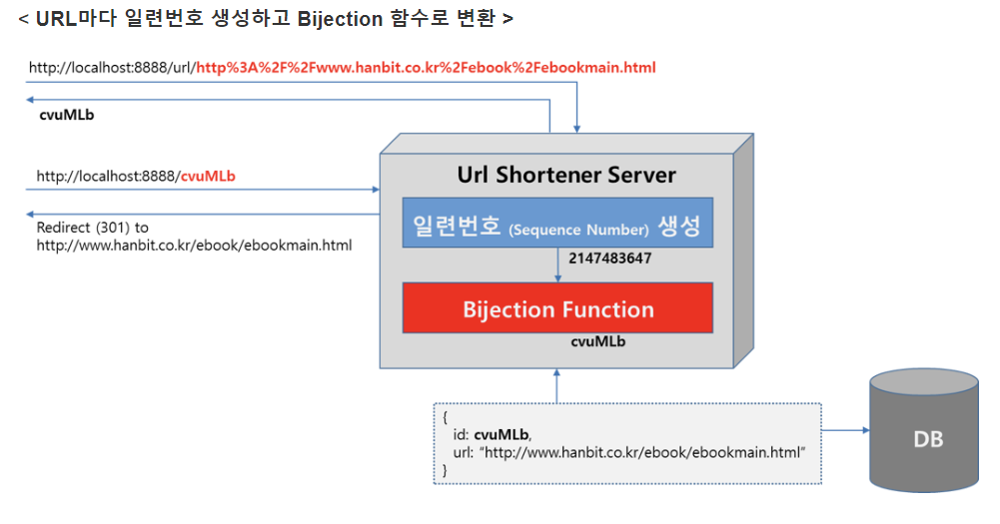
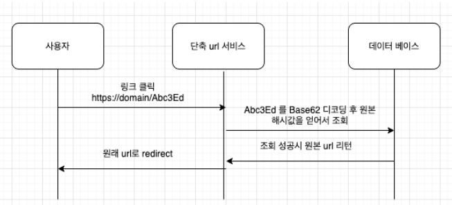

# Shorten URL

긴 원본 URL을 단축시켜서, 간결한 URL로 만드는 서비스

## Short URL 생성 원리
- 해당 URL을 직접적으로 인코딩하는 방식이 아닌 URL을 DB에 삽입하고 해당 Index를 인코딩하는 방식

- encoding방식은 base 62 이다.
  - base 64에서 62번은 + 기호이고, 63번은 / 기호를 나타내는데, url에 이 값들이 들어가게 되면 query string이 제대로 작동하지 않을 수 있기 때문에 이것을 뺀 base62를 사용한다.
  - hashing 방식은 단방향으로 decoding이 불가능하여 encoding방식을 사용하여 decoding도 할 수 있도록 한다.

## 실행 흐름
### 1. Short URL 생성
#### URL마다 일련번호 생성하고 Bijection 함수로 변환하는 방법 사용

1. 단축 Url 서비스를 운영하고 있는 도메인에 /url이라는 엔드포인트로 원본 Url을 POST로 요청함
2. 단축 Url 서비스에서는 해당 Url을 해싱
3. 해시값과 원본 url을 데이터베이스에 저장
4. 요청을 보낸 서버에 해시값의 앞 10자리를 자르고, Base62 인코딩 한 값인 문자열을 응답

5. 값을 받은 서버는 해당 Url 서비스의 도메인 링크에 + “/응답 값”을 붙여서 단축 Url 링크로 사용

### 2. 사용자가 실제 링크를 클릭했을 때
사용자가 단축된 Url(단축 Url 도메인 + /{value})을 클릭한 경우, 해당 value 값을 다시 Base62로 decoding 한 후, 데이터베이스를 조회해서, 원본 Url로 리다이렉트 시켜야 한다.

1. 사용자가 링크를 클릭했을 경우, 인코딩 값을 GET 요청을 통해서 단축 Url 서비스에 보낸다.
2. 단축 Url 서비스에서는 해당 값을 Base62으로 디코딩한다.
3. 원본 해시값의 앞 10자리를 얻어서 조회
4. 조회에 성공 시 데이터베이스에서 가져온 원본 Url로 사용자를 리다이렉트 시킵니다.

[참조 링크] : https://velog.io/@sweet_sumin/Shorten-URL%EC%9D%84-%EA%B5%AC%ED%98%84-%EB%B0%A9%EB%B2%95